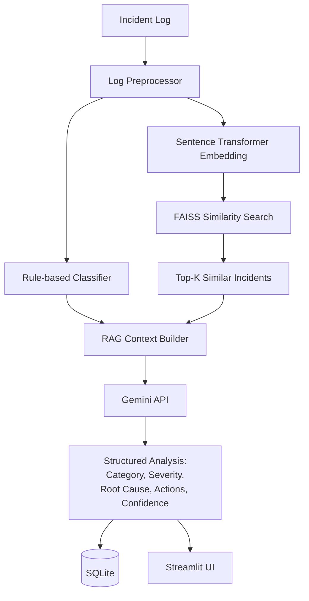

# AI Incident Resolver

An AI-powered incident resolution assistant that analyzes application/system error logs, retrieves semantically similar historical incidents, and uses a cloud LLM (Gemini) to generate a structured, evidence-grounded resolution.

## Overview

When an application fails, engineers usually start by pattern-matching the error against past incidents they remember — "this looks like the connection pool issue from last month." This project automates that first pass: it classifies the incident, finds genuinely similar historical cases using semantic search (not just keyword matching), and asks an LLM to synthesize a root-cause hypothesis and recommended actions, explicitly grounded in that retrieved context rather than invented from scratch.

It is a Retrieval-Augmented Generation (RAG) system applied to a practical DevOps/SRE problem, built to be fully explainable end to end — every component has one clear job.

## Features

- Rule-based incident classification (11 categories)
- Semantic similarity search over historical incidents using Sentence Transformers embeddings
- FAISS-based vector retrieval (cosine similarity via normalized inner product)
- Retrieval-Augmented Generation: retrieved incidents become grounding context for the LLM
- Gemini API integration for structured root-cause and remediation generation
- Blended confidence scoring (retrieval similarity + classifier agreement + model self-assessment)
- SQLite-backed incident history
- REST API (FastAPI) decoupled from the UI
- Streamlit frontend with an analysis view and a browsable history view

## Architecture



## Tech Stack

| Technology | Role | Why |
|---|---|---|
| **FastAPI** | Backend REST API | Async-capable, automatic OpenAPI/Swagger docs, strong typing via Pydantic |
| **SQLite** | Incident history storage | Zero-config, file-based, sufficient for the read/write volume of a single-instance project |
| **Sentence Transformers** (`all-MiniLM-L6-v2`) | Log embeddings | Lightweight model producing 384-dim vectors that capture semantic meaning, not just keywords |
| **FAISS** | Vector similarity search | Fast exact nearest-neighbor search over embeddings; `IndexFlatIP` on normalized vectors gives cosine similarity |
| **Gemini API** | Structured incident analysis | Cloud LLM reasoning over the current incident plus retrieved historical context |
| **Streamlit** | Frontend | Fast to build a functional UI without a separate JS framework; talks to the backend purely over HTTP |

## Project Structure

```
ai-incident-resolver/
├── backend/
│   ├── main.py              # FastAPI app, routes, startup lifecycle
│   ├── database.py          # SQLite engine/session setup
│   ├── models.py            # SQLAlchemy Incident model
│   ├── schemas.py           # Pydantic request/response models
│   ├── services/
│   │   ├── log_parser.py    # Cleans/normalizes raw logs before processing
│   │   ├── classifier.py    # Keyword-based category classification
│   │   ├── retriever.py     # Embeddings + FAISS index + similarity search
│   │   └── resolver.py      # RAG context building + Gemini API call
│   └── data/
│       └── incidents.json   # Seed dataset of ~78 historical incidents
├── frontend/
│   └── app.py                # Streamlit UI (analyze + history pages)
├── .env.example
├── .gitignore
├── requirements.txt
└── README.md
```

## Installation

```bash
git clone <your-repo-url>
cd ai-incident-resolver

python -m venv venv
venv\Scripts\activate

pip install -r requirements.txt
```

### Configure the Gemini API key

```bash
copy .env.example .env
```

Open `.env` and set your key:

```
GEMINI_API_KEY=your_api_key_here
```

`.env` is listed in `.gitignore` and must never be committed.

## Running the backend

```bash
uvicorn backend.main:app --reload
```

Runs at `http://127.0.0.1:8000`. On startup it initializes the SQLite database and builds the FAISS index from the seed dataset.

## Running the Streamlit frontend

In a separate terminal, with the backend still running:

```bash
streamlit run frontend/app.py
```

Opens at `http://localhost:8501`.

## API Testing

- **Swagger UI:** `http://127.0.0.1:8000/docs` — interactive docs generated automatically from the Pydantic schemas.
- **Postman:** import the endpoints below and set the base URL to `http://127.0.0.1:8000`.

### Endpoints

| Method | Path | Purpose |
|---|---|---|
| GET | `/health` | Liveness check |
| POST | `/incidents/analyze` | Full analysis pipeline; returns structured result and stores it |
| POST | `/incidents` | Same pipeline, returns the stored record shape |
| GET | `/incidents` | List all analyzed incidents |
| GET | `/incidents/{id}` | Full detail for one incident |

## Example

**Request:**
```json
POST /incidents/analyze
{
  "log": "ERROR: Connection refused to PostgreSQL at 10.0.0.21:5432, retry attempt 3/3 failed"
}
```

**Response (abbreviated):**
```json
{
  "incident_id": 1,
  "category": "database",
  "severity": "critical",
  "root_cause": "Likely the PostgreSQL database server is unavailable or unreachable.",
  "recommended_actions": [
    "Check whether the PostgreSQL service is running",
    "Verify the database host and port",
    "Check network connectivity between the app and database host"
  ],
  "confidence": 0.79,
  "similar_incidents": [
    {"id": 1, "log": "Connection refused while connecting to PostgreSQL server...", "similarity": 0.72}
  ]
}
```

## Future Improvements

- Real-time log ingestion (tailing live application logs rather than manual paste)
- Alerting integration (Slack/PagerDuty) when critical incidents are analyzed
- Authentication on the API for multi-user deployment
- A larger, more diverse incident knowledge base
- Integration with existing monitoring/observability tools
- Feedback loop where engineers mark whether a suggested resolution actually worked, to improve future retrieval ranking

None of the above is implemented yet — the current system is a single-user, locally-run prototype.